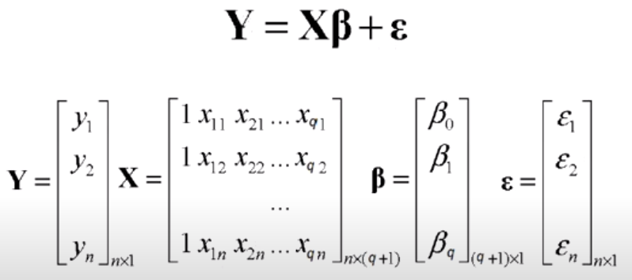
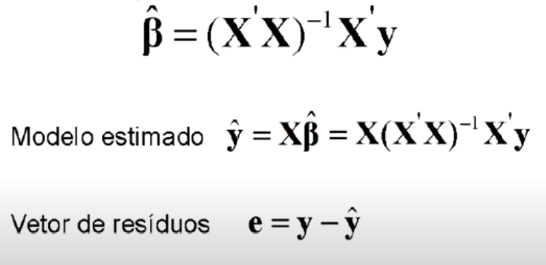

# Explicação Teórica - Múltipla

Nesta etapa teremos a introdução teórica sobre Regressão Linear Múltipla, é muito importante compreender a teoria do método antes de aplicá-lo na prática.

## Motivação

Como visto anteriormente, a Regressão LInear Simples está relacionada com o estudo da influência de uma cováriavel em uma variável dependente Y, em que nos estudamos como a covaríavel influencia nos valores de Y. Como na maioria dos casos a variável Y não pode ser explicada somente por uma cováriavel, precisamos realizar o estudo de um conjunto de cováriavies influenciando nos valores de Y, e para isto precisamos utiilizar a Regressão Linear Múltipla. Entretanto, semelhantemente a Regressão Linear Simples, podemos descrever a equação para a Regressão Múltipla da seguinte forma:

$$
y = \beta_0+\beta_1X_1+\beta_2X_2+...+\beta_jX_j+E
$$

Tal que j é o número de cováriaveis do nosso conjunto de dados.

## Regressão Linear Múltipla

A Regressão Linear Múltipla é uma variação da regressão simples, em que ao inves de termos apenas uma cováriavel para explicar a variável dependente Y, temos j cováriaveis que serão utilizadas para tentar explicar a variação da variável Y. Desta maneira, contínuamos com o domínio dos valores numéricos e na tentativa de prever um valor númerico, geralmente contínuo. Semelhantemente a Regressão simples devemos estimar os coeficientes da reta para tentar compreender qual a influência de cada um na variação de Y.

### Explicação Matemática

Para realizar a estimação dos coeficientes de cada cováriavel devemos realizar um processo semelhante a regressão simples, mas expandido para múltiplas variáveis, o que dificultaria muito o processo de ser realizado manualmente, visto que envolveria multiplicações de matrizes, cálculos de derivadas parciais em quantidade e realização de muitos cálculos. Assim, não é muito relevante entender como funcionam os cálculos, mas podemos abstrair e entender um pouco.

E para realizar este cálculo, podemos transformar nossas operações em matrizes e realizar as multiplicações. Inicialmente, para o cálculo de cada coeficientes, podemos ter a equação dada por:

E dessa maneira os coeficientes poderiam ser calculados da seguinte maneira:

Assim, para realizarmos a previsão de Y, é necessário fornecer um vetor com os valores das cováriaveis no modelo e substituir o valor na equação da regressão após estimar os coeficientes encontrados pela técnica acima. Felizmente, a maioria dos softwares realizam este cálculo de maneira bem rápida e eficiente, então o que resta para nós é conseguir analisar os resultados bem e entender os coeficientes e sua relação com a variável dependente Y.

## Exemplo

Uma possível aplicação da Regressão LInear Múltipla pode ser no estudo de como o capital investido pela empresa e o valor gasto em publicidade podem influenciar no lucro anual da empresa. Para isso, com os dados e coeficientes fornecidos pelo material do Professor Guilherme Lopes de Oliveira, do CEFET-MG, podemos realizar uma breve análise.

Primeiro, a equação da regressão para este caso seria:

$$
y = \beta_0+\beta_1X_1+\beta_2X_2+E
$$

Tal que X1 se refere ao capital e X2 se refere ao investimento em publicidade, podemos realizar a análise das variáveis para verificiar a linearidade entre eles, e entender se é possível traçar uma reta entre elas. Para isso, basta visualizarmos o gráfico de uma variável pela outra e tentar visualizar uma relação linear, e verificar se as variáveis estão relacionadas linearmente.

Em seguida podemos realizar uma análise da influência das variáveis na variação de Y com os seus coeficientes. Neste caso, os coeficientes encontrados foram:

$$
y = 3.4-0.08X_i+1.36X_2
$$

Com isto podemos realizar as seguintes análises, apenas com os valores do coeficiente:

Caso duas empresas possuam o mesmo valor investido em publicidade, um aumento de um milhão no investimento em capital da empresa, prevê uma diminuição de 0.08 milões no lucro anual. Ou seja, se uma empresa investe mais dinheiro em capital, mas mantém seu investimento em publicidade igual, o modelo estima que o lucro irá diminuir, o que é entendível.

Caso duas empresas possuam o mesmo valor de capital, um aumento de um milão gasto em publicidade irá acarretar em um aumento no lucro anual de 1.36 milhões. Ou seja, se uma empresa investe mais dinheiro em publicidade do que outra, e ambas tem o mesmo valor em capital, a tendência estimada pelo modelo é que o lucro aumente, o que na teoria faz sentido.

## Análise de resultados

Semelhantemente a regressão linear simples, para a múltipla também devemos analisar os resultados para entender melhor se eles realmente são bons resultados. Para isto, temos diversas métricas/testes que podem ser realizados para isso.

### Coeficiente de determinação ajustado

Na regressão simples, utilizávamos o R2-Score para medir o quão ajustado um modelo estava em relação ao conjunto de dados, evidenciando a qualidade do modelo em termos de potencial de explicação da variabilidade de Y em relação a X, ou seja,  o quanto X explicava Y. Entretanto, para a regressão múltipla, como temos diversas covariáveis, precisamos tomar cuidado. O R2-Score é uma boa técnica a ser utilizada caso estejamos comparando modelos com a mesma quantidade de variáveis, já que caso os nosso modelos tenham quantidades de cováriaveis diferentes, o valor de R2 não será algo comparável, visto que caso tenhámos mais variáveis em um modelo o R2-Score irá aumentar em relação a um modelo com menos variáveis, ou seja, se tivermos o modelo M1 com 4 cováriaveis e o modelo M2 com 5 cováriaveis, provavelmente o modleo M2 terá um R2-score, oque não necessariamente significa que M2 é um modelo melhor que M1. Assim, para corrigirmos isto podemos utilizar o R2-Score-Ajustado, visto que esta métrica leva em conta a quantidade de cováriaveis e pondera o R2-Sore pelo número q de variáveis independentes, levando  a uma comparação coerente entre modelos, sem nenhum tipo de viés ou de perturbação derivada da quantidade de cováriaveis. Analogamente, esta nova métrica dispõe da mesma interpretação que o R2 promove, ou seja, o coeficiente ajustado irá demonstrar a porcentagem que as cováriaveis explicam a variável dependente Y. Novamente, a maioria dos softwares expões este valor nos resultados e basta a nós analisarmos os valores.

De qualquer forma, a fórmula desta métrica pode ser visualizade abaixo:

$$
R²_{ajust} = 1 - (1- R²)(\frac{n-1}{n-q-1})
$$

Tal que n é o número de amostras e q é o número de cováriaveis.

### Teste F de significância

Na regressão linear, para realizar a validação do coeficiente tinhámos o teste-T, onde estudávamos de era necessário rejeitar ou aceitar os coeficientes. Na regressão múltpla, ainda podemos aplicar o teste-t para os coeficientes de maneira individual, mas previamente, precisámos realizar o teste-F, que consiste em verificar se o modelo é significativo, ou seja, verificar se pelo menos um dos coeficientes angulares deve ser aceito. Assim, para testarmos as hipóteses alternativa e nula, utilizamos a estátistica F, que  segue uma distribuição de **Fisher-Snedecor**, com q e n-q-1 graus de liberadade e é utilizada para testar a significância geral do modelo global. Assim:

$$
H_0: \beta_1=0  \& \beta_2=0  \& \beta_3=0  \& ... \beta_q=0  
$$

$$
H_1: \beta_1 \neq 0  |\beta_2\neq0  | \beta_3\neq0  | ... \beta_q\neq0  
$$

Isto significa que: Ao aceitarmos a hipótese nula, entendemos que todos os coeficientes é igual a zero, e dessa forma não podermos explicar Y linearmente pelas cováriaveis do nosso conjunto, agora caso recusamos a hipótese nula, resultando no aceite da hipótese alternativa, entendemos que pelo menos um dos coeficientes do nosso modelo é diferente de zero e dessa forma, temos uma relação linear entre nosso conjunto. Para este teste, seguiremos quase os mesmo passos do teste-T, escolhendo um nível de significância e aceitando a hipótese alternativa se P(F) < $\alpha$. Felizmente a maioria dos software já disponibiizam o valor de F e de P(F), nosso papel e definir um nível de signifiância e verificar se aceitamos ou não a hipótese NULA. Caso a hipótese nula seja recusada, significa que temos pelo menos um coeficiente que é significativo para explicar Y linearmente, e então para verificar qual/quais coeficientes são significativos aplicamos o teste-t para cada coeficiente individualmente, so que ao invés de n-2 graus de liberdade, teremos n-q-1 graus de liberade. A maioria dos softwares também já disponibiliza este valor para nós, mas temos que lembrar que nesse caso precisamos multiplicar a probabilidade por 2, já que trata-se de um teste bilateral.

### Exemplo de Teste-F e Testes-T

Novamente do material retirado do Professor Guilherme Lopes de Oliveira, do CEFET-MG temos o seguinte cenário:

$$
Lucro = 3.4+2.61X_1-0.118X_2
$$

Com a seguinte tabela como resultado produzido pelo software:

| Nome | Coef | Err | valor-P | P(t) |
| --- | --- | --- | --- | --- |
| B0 | 3.4 | 3.42 | 0.99 | 0.346 |
| B1 | 2.6 | 0.52 | 4.94 | 0.01 |
| B2 | -0.118 | 0.13 | -0.9 | 0.392 |

Tal que F = 12.77 e P(F) para este caso é P(F) = 0.002.

Nesse caso, definindo um nível de significância de 5%, podemos aceitar a hipótese alternativa para o teste-F, e dessa forma entendemos que pelos menos um dos coeficientes é significativo para explicar linearmente a relação entre as variáveis e Y.

Realizando o teste-t, rejeitamos a hipótese nula para B1, mas para B2 e B0 devemos aceitar a hipótese NULA. Mas, para re-ajustarmos a reta, precisamos remover B2, já que ele será igual a 0 com 5% de nível de significância e precismos reefazer o processo de regressão e então realizar novos testes para verificar B0, caso B0 novamente não puder ser aceito, devemos removê-lo e apenas deixar B1.
