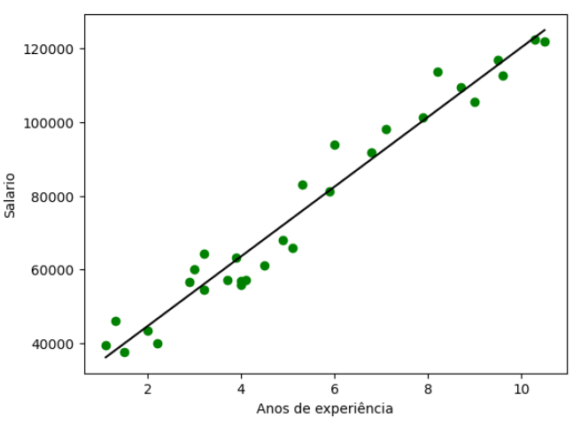

# Explicação Teórica - Simples

Nesta etapa teremos a introdução teórica sobre Regressão Linear Simples, é muito importante compreender a teoria do método antes de aplicá-lo na prática.

## Motivação

Na área da ciência de dados algo muito comum de ser realizado é o interesse em entender o relacionamento entre uma variável com diversas outras, para poder explicar o comportamente de uma variável a partir de outras. Um exemplo disso pode ser: Fumar causa cancer de pulmão? Para responder esta pergunta seria necessário entender a relação destas duas variáveis e verificar se uma realmente tem alguma relação com a outra. Para isso é interessante realizar a Regressão, que é um método estatístico para investigar essas relações entre variáveis.

Sendo assim, como estamos lidando com dados e a extração de informações dos dados é interessante realizar um vasto estudo na área de Regressão linear pois é uma das formas mais antigas de compreender relacionamentos entre atributos e pode ser utilizado para diversas tarefas, incluindo a predição de valores de variáveis.

## Regressão Linear Simples

A regressão linear simples investiga a relação entre duas variáveis, verificando qual a influência de uma variável no valor da outra. Este conceito foi inicialmente introduzido por Francis Galton em 1908 quando este estava envolvido em um estudo sobre hereditariedade. O primeiro estudo envolvendo regressão simples, foi feito envolvendo a altura de pais e filhos. Sendo assim, podemos compreender que a regressão simples, discute a relação entre uma variável dependente y e uma variável independente x.

Paralelamente, podemos entender, que a Regressão linear simples consegue realizar a predição de um valor com base em uma reta que descreve os valores “preditos” por cálculos estatísticos.

Antes de utilizarmos a regressão para prever valores na prática é muito importante compreender como este método funciona em temos matemáticos.

### Explicação Matemática

A regressão linear simples pode ser expressa pela Equação de regressão abaixo:

$$
y = \beta_0+\beta_1x+u
$$

Nesse caso, podemos definir as variáveis a seguir:

| Nome | Função |
| --- | --- |
| y | A variável dependente que se quer estudar a relação |
| x | A variável independente que se quer estudar a influência na variável dependente |
| B0 | Intercept. Coordenada de origem da reta modelada pela Equação |
| B1 | Coeficiente de inclinação para o atributo 1, neste caso só temos 1 |
| u | Erro do modelo. |

Para realizarmos o cálculo de cada um destes valores precisaremos entender a matemática por trás da Regressão. Para isso, utilizaremos o método dos ****mínimos quadrados****

Inicialmente, observando a Equação de regressão descrita a cima, podemos compreender, que esta pode ser descrita para cada observação, ou seja, para cada objeto (X,y). Deve-se atentar que nesse caso precisaremos de um conjunto amostral que será utilizado para a construção do modelo. Neste caso, temos a seguinte equação para cada objeto:

$$
y_i =\beta_0+\beta_1x_i+u_i
$$

Além disso, para conseguirmos estimar os valores de B0 e B1, é necessário que: O erro U tenha média zero, e seus valores sejam independentes de X, e entre si, levando a uma covariâcia com X sendo igual a zero. Com estas hipóteses, podemos formular duas novas equações.

$$
E(u) = 0
\newline
Cov(x,u) = E(xu) = 0
$$

Desta maneira, podemos reescrever estas equações apresentar, substituindo os valores para que seja possível estimar o valor de B1 e B0. Com uma simples reoorganização da equação de regressão apresentada inicialmente, podemos iniciar a estimação dos valores.

$$
E(y-\beta_0-\beta_1x)=0
\newline
E(x[y-\beta_0-\beta_1x])=0
$$

Lembrando, que E(u), representava a média de u, que como hipótese, deveria ser 0, logo podemos remover este E como função e transformá-lo na média amostral da equação, para podermos manipular mais facilmente a equação.

$$
n^{-1} \sum_{i=1}^n{y_i-\hat{\beta_0}-\hat{\beta_1}x_i}
$$

Para compreendermos melhor a equação o $y_i$ seria o i-ésimo objeto da variável dependente y, e o mesmo vale para $x_i$. Já, os estimadores contém um chapeu, pois serão valores estimados.

Com a equação acima, podemos inferir um possível método para calcular $\hat{\beta_0}$.

$$
\hat{\beta_0} = \bar{y} - \hat{\beta_1}\bar{x}
$$

Neste caso, $\bar{y}$ e $\bar{x}$ são as médias amostrais, que podem ser facilmente calculadas e são valores conhecidos. Já o valor de $\hat{\beta_1}$  ainda não é conhecido e precisa ser inferido, mas já temos um método para encontrar o valor de $\hat{\beta_0}$.

Para estimarmos a inclanação da reta, é nessário utiliza a seguinte fórmula já apresentada, que pode ser reorganizada.

$$
E(x[y-\beta_0-\beta_1x])=0
\newline
\sum_{i=1}^n{x_i(y_i-\bar{y} + \hat{\beta_1}\bar{x}-\hat{\beta_1}x_i)} = 0
$$

Com um áuxilio das propriedades do somatŕoio, que evidenciam o seguinte teorema, em que $\bar{x}$ e $\bar{y}$são as médias amostrais das variáveis, é verdadeiro:

$$
\sum_{i=1}^n{x_i(x_i-\bar{x})} = \sum_{i=1}^n{(x_i-\bar{x})^2}
\newline
\sum_{i=1}^n{x_i(y_i-\bar{y})} = \sum_{i=1}^n{(x_i-\bar{x})(y_i-\bar{y})}
$$

Com esta grande ajuda das propriedade so somatório, podemos facilmente estimar o valor de $\hat{\beta_1}$

como sendo:

$$
\hat{\beta_1} = \frac{\sum_{i=1}^n{(x_i-\bar{x})(y_i-\bar{y})}}{\sum_{i=1}^n{(x_i-\bar{x})^2}}
$$

Como o nome do método para estimar estes valores sugere, os dois estimadores são chamados de Estimativas de Mínimos Quadrados Ordinários (MQO). Entretanto, além disso, ainda temos outra variável a ser calculada, o erro. O erro é calculado pela diferença entre o valor observado e o valor estimado pelo modelo, e a ideia por trás da regressão é que os MQO devem minimizar este erro. Como podemos compreender, o erro é calculado por uma das seguintes equações:

$$
u_i = \hat{y}-y

\newline

u_i = \hat{\beta_0} + \hat{\beta_1}x_i - y 
$$

Além disso, é extremamente importante validar o quão uma reta de regressão se ajustou ao conjunto de dados. Para isso, podemos utilizar as seguintes medidas: Soma dos quadrados total (SQT), Soma dos quadrados explicada (SQE) e Soma dos quadrados dos resíduos (SQR). Estas medidas, podem ser calculadas com as fórmulas abaixo:

$$
SQT=\sum_{i=1}^n{(y_i-\bar y)}

\newline

SQE = \sum_{i=1}^n{(\hat{y_i}-\bar y)}

\newline

SQR=\sum_{i=1}^n{(u_i)^2}
$$

Com estas medidas podemos calcular uma das mais importante métricas da regressão, a R2. Esta medida é a razão entre a variação explicada e variação total, assim podemos interpreta-la como a fração da variaçã da amostra em y que pode ser explicada por X, ou seja, o quão bem podemos explicar a variável y utilizando os valores da variável X, ou ainda melhor, o quão forte é a relação que X tem na variável Y. Logo, quanto mais perto de zero, significa que X não consegue explicar tão bem a variável Y, já caso esteja perto de 1, demostra que X consegue explicar bem as variações na variável Y. As equações para encontrar o R2 podem ser visualizadas abaixo

$$
R2 =\frac{SQE}{SQT}
\newline
R2 = 1 - \frac{SQR}{SQT}
$$

## Teste de Hipótese

O teste de hipóteses é a validação de uma afirmação sobre um parâmetro populacional que se deseja ser estudo. Esste teste pode ser utilizado em diversas ocasiões, mas nesse caso focaremos em sua aplicação para a Regressão Linear Simples. Nesse contexto. as duas variáveis que queremos validar seriam $\beta_0$ e $\beta_1$. Dessa maneira, o teste de hipóteses permite entender se os coeficientes encontrados realmente são válidos para o nosso conjunto de dados e podem ser utilizados.

Assim, precisamos compreender a ideia prática por trás do teste de hipótese, para já enfatizar, no caso da Regressão Linear simples o teste que será abordado será o Teste T, bilateral.

$$
H_0: \beta_0 = 0

\newline 

H_1: \beta_0 \neq 0
$$

$$
H_0: \beta_1 = 0

\newline 

H_1: \beta_1 \neq 0
$$

Inicialmente vamos compreender oque estes resultados significam. Para o coeficiente $\beta_0$ caso não recusassemos  a hipótese $H_0$, a hipótese NULA, iriamos aceitar que $\beta_0$ seria rejeitado, e precisáriamos reajustar a equação de regressão, já se rejeitassemo $H_0$ iriamos assumir que $\beta_0$ é um coeficiente adequado e que se ajusta bem ao conjunto de dados. Logo, com este teste, podemos validar mais ainda os coeficientes encontrados durante a regressão. Nota-se que a mesma coisa vale para $\beta_1$, e $\beta_0$ e $\beta_1$ não precisam necessariamente serem aceitos juntos ou não.

### Teste T

O teste T representa se uma variável está adequada a uma distribuição t-student com um grau N de liberade, no caso realizado a seguir, utilizaremos como grau de liberade n-2, tal que N é o tamanho do conjunto amostral. Logo, precisámos definir algumas coisas.

1. O erro tem média zero.
2. Os erros devem ter variância constante
3. Os erros devem ser independentes

Após definido, precisamos calcular a variância do erro, para poder realizar o teste de hipóteses. Para isso, podemos utilizar a soma dos quadrados dos resíduos apresentados anteriormente para realizar esta tarefa.

$$
\sigma^2 = \frac{SQR}{n-2}
$$

Após isto podemos inciar o teste, em que vamos verificar a adequação de um modelo de regrssão linear em relação aos seus coeficientes. Os tests vão verificar a significância da relação linear na população. Logo, iremos comprovar se a relação linear entre X e Y é realmente significativa.

### Teste de hipótese para $\beta_0$

Testaremos se a reta passa pela origem ou não, verificando se o parãmetro realmente precisa existir. Para isso utilizaremos as seguintes equações

$$
H_0: \beta_0 = 0

\newline 

H_1: \beta_0 \neq 0
$$

$$
T_{obs} = \frac{\hat{\beta_0}}{\sqrt{\sigma^2[\frac{1}{n} + \frac{\bar x}{S_{xx}}]}}
$$

Tal que Sxx é dada pelo somatório dos quadrados da diferença entre $x_i$ e a média amostral do conjunto de dados da variável X.

$$
S_{xx}=\sum_{i=1}^n{(x_i-\bar x)^2}
$$

Após calcularmos o $T_{obs}$ que é o valor da estátistica observada para a variável em questão precisamos encontrar o valor-p e definir um valor de significância. O valor de significância representa a probabilidade do Erro do tipo 1 acontencer, que é o erro de Rejeitar $H_0$ mesmo ela sendo verdadeira, ou seja, qual a chance deste teste ter um erro. Geralmente, estes valores são entre 10%-1%, podendo ser maior ou menos dependendo do caso. Já o valor-p é um valor pré-determinado referente a própria distribuição T-student. Como estamos lidando com um teste bilateral, para descobrirmos o valor-p, podemos utilizar a seguinte estrutura:

$$
valor-p = 2P(t_{n-2}||T_{obs}|)
$$

Para encontrarmos este valor, devemos checar a tebela de t-student abaixo:


Para interpretarmos esta tabela pegaremos um exemplo aleátorio:

```
N = 10
T_obs = 3.6
nível de significância = 5%
```

Desta maneira, verificamos que o valor de P seria de 0.005, visto que 3.6 é maior que 3.35 mas menor que 3.83. Assim, como precisamos multiplicar por 2, já que se trata de um teste bilateral, o valor-p seria de 0.01. Como nosso nível de singificância foi pré-determinado em 5%, valor-p < 0.05, então para um nível de significância de 5% rejeitamos $H_0$ entendendo que o coeficiente $\beta_0$ este bem ajustado ao nosso conjunto. Entretanto, caso nosso nível de significância fosse igual a 1% $H_0$  não seria rejeitado, e então teríamos que re-ajustar nossa equação.

### Teste de hipótese para $\beta_1$

Testaremos se realmente há uma relação linear entre Y e X que possa ser significativa e explicada pelo coeficiente. Se nos reijeitamos a hipótese nula, siginifica que temos um fator linear entre as variáveis, caso contrário, não temos uma relação linear entre as variáveis.

$$
H_0: \beta_1 = 0

\newline 

H_1: \beta_1 \neq 0
$$

$$
T_{obs} = \frac{\hat{\beta_1}}{\sqrt{\frac{\sigma^2}{S_{xx}}}}
$$

Tal que Sxx é dada pelo somatório dos quadrados da diferença entre $x_i$ e a média amostral do conjunto de dados da variável X.

$$
S_{xx}=\sum_{i=1}^n{(x_i-\bar x)^2}
$$

Após calcularmos o $T_{obs}$ que é o valor da estátistica observada para a variável em questão precisamos encontrar o valor-p e definir um valor de significância. O valor de significância representa a probabilidade do Erro do tipo 1 acontencer, que é o erro de Rejeitar $H_0$ mesmo ela sendo verdadeira, ou seja, qual a chance deste teste ter um erro. Geralmente, estes valores são entre 10%-1%, podendo ser maior ou menos dependendo do caso. Já o valor-p é um valor pré-determinado referente a própria distribuição T-student. Como estamos lidando com um teste bilateral, para descobrirmos o valor-p, podemos utilizar a seguinte estrutura:

$$
valor-p = 2P(t_{n-2}||T_{obs}|)
$$

Para encontrarmos este valor, devemos checar a tebela de t-student abaixo:


Para interpretarmos esta tabela pegaremos um exemplo aleátorio:

```
N = 15
T_obs = 2.750
nível de significância = 1%
```

Desta maneira, verificamos que o valor de P seria de 0.01, visto que 2.75  é maior que 2.65 mas menor que 2.801. Assim, como precisamos multiplicar por 2, já que se trata de um teste bilateral, o valor-p seria de 0.02. Como nosso nível de singificância foi pré-determinado em 1%, valor-p > 0.01, então para um nível de significância de 1% aceitamos $H_0$ entendendo que o coeficiente $\beta_1$ não demonstra uma linearidade significativa entre X e Y. preciasndo ser ajustado.

## Suposições do modelo

Para realizarmos a análise da regressão é necessário fazer algumas suposições sobre o nosso modelo. Esta suposições devem ser verificadas caso o nosso objetivo seja inferência, para a predição não é algo extremamente necessário.

1. O erro é uma variável aleatória com valor esperado igual à 0
2. Variância do erro é a mesma para todos os valores da variável independente. (Podemos verificar em um grafo que contenha Var(Erro) x VI )
3. Erro é independente
4. O erro é normalmente distribuído (Podemos verificar com QQplot)


## Exemplo

Para compreendermos na prática a ideia de regressão podemos visualizar esta ideia na prática em um exemplo bem simples. Para isso, utilizaremos um conjunto de dados retirado do Kaggle, que contém dados sobre Anos de Experiência de um indivíduo e seu Salário, levando em conta a mesma área de atuação. Neste exemplo, temos poucos exemplos, então não dividiremos o conjunto de dados em treino e teste, e isto será feito apenas para verificar as métricas e compreende-las, ou seja, entender a teoria da regressão.

A primeira coisa que podemos verificar, é a reta que foi traçada com a realização da regressão e o quão longe dos pontos observados ela está. Nota-se que, os pontos verdes são os pontos observados na realidade, e a reta preta é a reta construída com base no modelo estatístico.



Podemos, compreender que como esperado, a reta se ajustou muito bem ao conjunto de dados, pelo simples fato de ser bem pequeno e utilizarmos o mesmo conjunto para tudo. Entretanto com isso podemos verificar os coeficientes da reta e calculá-los.

O modelo de Regressão utilizado é implementado pela biblioteca do Scikit-Learn, e desta maneira, podemos verificar os coeficientes facilmente. Ao fazer isto, a reta gerada tem a seguinte equação:

$$
y = 25792.20 + 9449.96x
$$

Com isso, podemos realizar o cálculo manual para verificar as etapas e demonstrar que a prova matemática realizada anteriormente esta coerente com a biblioteca do Sklearn.

Para isso, podemos construir as seguintes funções que serão responsáveis pelo cálculo dos coeficientes:


Caso, executássemos essas funções, chegariámos aos mesmos valores proporcionados pelo Sklearn, comprovando a teoria matemática.

Além disso, podemos verificar também o R2-Score, a métrica que nos ajuda a entender o quão ajustado a reta está em relação ao conjunto de dados. Como utilizamos os mesmo dados para tudo, em teoria o R2-Score será um valor bem alto, mas isso não é o nosso interesse nesta prática, o que nos interessa é verificar as equações e ver se elas estão coerentes com os resultados do Sklearn. Para isso, construímos as seguintes funções para o cálculo das métricas:


Felizmente, os resultados encontrados por estas funções e pelo Sklearn foram iguais, comprovando mais uma vez a coerencia entre os cálculos exibidos acima e a teoria.

Em seguida podemos realizar o teste de hipóteses para ambos os coeficientes. Esta parte é bem interessante e pode ser realizada com o auxílio de uma API do Scipy que consegue fornecer uma visualização muito interessante dos resultados e também uma eficiência. É importante ressaltar que esse OLS é referente ao nome do método realziado para encontrar os estimadores Ordinary Least Squares Regression (OLS), ou em portugûes, métodos dos quadrados mínimos, o mostrado aqui.


Com esta tabela, conseguimos compreender a maioria dos resultados de uma maneira muito mais simples, simplificando em muito o processo de Regressão e Análise dos Resultados. Entretanto mesmo facilitando, é necessário ter conhecimento teórico para conseguir compreender corretamente os resultados. No exemplos mostrado, fica evidente a forte relação entre as duas variáveis, tendo em vista que são aceites para todos os níveis de significância, visto que seu valor para a estatística T é muito alto, fazendo com que caso observassémos a tabela, o valor de t-student para este valor de T seria muito pequeno.

Concluindo, foi possível compreender como podemos realizar a Regressão Linear Simples, para encontrar a relação que uma variável tem em relação a outra, e além de verificar a parte teória, abordando métodos para calcular, análise de resultados, também pudemos ver que a teoria é comprovada na prática e pode ser comprovada caso seja necessária. Ademais, será apresentado um caso para a Regressão Linear SImples, e todos os passos para conseguir realizá-la da melhor forma.
