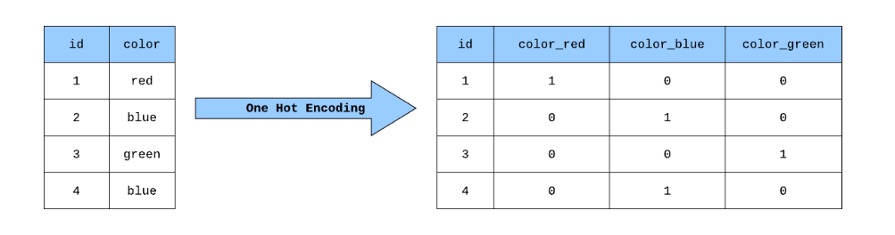
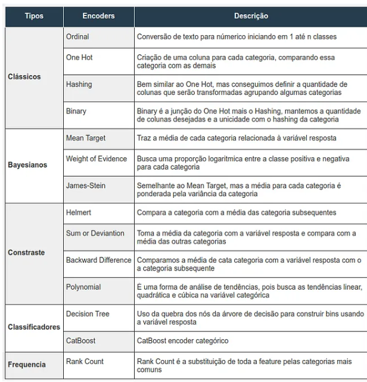
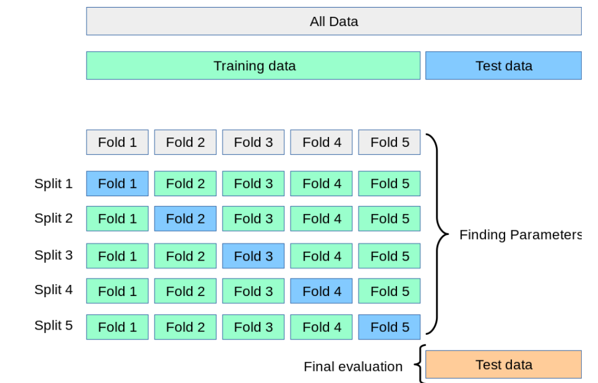
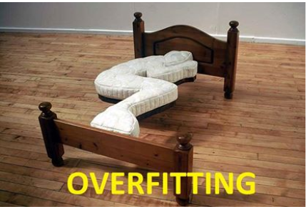
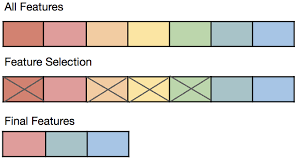

# Tópicos Adicionais: Regressão

Nesta parte veremos alguns tópicos adicionais em relação a regressão e entender como lidar com alguns problemas principais na tarefa de regressão linear, tanto múltipla como simples.

## Variáveis Categóricas

Como estamos lidando com a tarefa de Regressão linear, nosso modelo não é capaz de lidar com variáveis categóricas, ou seja, variáveis que não são numéricas, visto que é necessário realizar operações algébricas para ajustarmos as retas e estimar os coeficientes. Assim é necessário codificar os valores categóricos para valores numéricos, entretanto esta tarefa pode ser desafiadora.

### Solução 1: Transformar para valores [0,1,2,3,4,5…]

Esta solução é a mais simples de todas, porém ela tem um problema. Como podemos ver, o número está em ordem crescente, e dessa maneira nosso modelo pode interpretar que há uma relação de ordem entre os valores da variável categórica,o que as vezes pode acontecer, mas em muitos casos não há uma relação de ordem entre elas, então caso nosso conjunto tenha uma variável categórica em seu domínio, e esta variável tenha uma relação de ordem entre seus valores, podemos aplicar está técnica, caso contrário, não devemos realizar isto. 

### Solução 2: Remoção do atributo

Esta solução também é bem simples, mas é bem problemática, já que faz com que a gnt perca um atributo do nosso conjunto de dados que pode ter alguma relevância para estimar Y, logo é bem pouco utilizada e se utilizada, precisamos estudar bastante o atributo para entender se realmente podemos excluí-lo.

### Solução 3: One-Hot-Encoding

Esta solução é uma das mais usuais de ser realizada e é bastante interessante para lidar com variáveis categóricas em tarefas que devemos lidar com variáveis numéricas. Esta técnica consiste em criar p-1 atributos dummies, em que p é  a quantidade de valores distintos da variável categórica e atribuir valores binários para a identificação do valor. Este processo, embora seja bem interessante, resulta em um aumento drástico no número de dimensionalidades do conjunto de dados o que muitas vezes pode dificultar a interpretação da regressão e de seus coeficientes já que caso o número de variáveis for de n-1, tal que n é o tamanho do conjunto de amostras, podemos não ser capazes de inferir os parâmetros, já que não teremos graus de liberade suficiente, assim devemos ter cuidado ao utilizar esta técnica. Um exemplo disto, pode ser visto abaixo:



### Solução 4: Outros encoders

Na literatura possuímos muitos encoders para lidar com atributos categóricos, e dessa forma o interessante é aplicar o que melhor se adequa para a sua tarefa e para o seu conjunto de dados. O link abaixo, exibe diversas técnicas de encoders com uma explicação muita vasta e que promove um entendimento muito bom sobre os encoders.

[https://medium.com/datarisk-io/como-melhor-tratar-variáveis-categóricas-para-modelos-de-machine-learning-parte-1-a0e3a946bb1e](https://medium.com/datarisk-io/como-melhor-tratar-vari%C3%A1veis-categ%C3%B3ricas-para-modelos-de-machine-learning-parte-1-a0e3a946bb1e)

Além disso, no link acima, podemos visualizar a tabela abaixo, em que os encoders são exibidos:



## Multi-Colineariedade

A multicolinearidade é um conceito importante na análise de regressão linear, que ocorre quando duas ou mais variáveis independentes em um modelo de regressão estão altamente correlacionadas entre si. Isso significa que essas variáveis têm uma relação linear substancial, o que pode causar problemas na estimativa dos coeficientes de regressão e na interpretação dos resultados. Vamos explorar o que é a multicolinearidade, como podemos identificá-la, os problemas associados a ela e se é necessário tratá-la, dependendo do objetivo da análise.

**O que é Multicolinearidade:**

A multicolinearidade surge quando as variáveis independentes em um modelo de regressão estão fortemente correlacionadas, o que significa que uma variável pode ser prevista com alta precisão a partir de uma combinação linear das outras variáveis independentes no modelo. Isso pode dificultar a distinção entre os efeitos individuais de cada variável independente sobre a variável dependente.

**Como Identificar a Multicolinearidade:**
Existem várias maneiras de identificar a multicolinearidade em um modelo de regressão:

1. **Matriz de Correlação:** Calcule a matriz de correlação entre as variáveis independentes. Correlações próximas a 1 ou -1 indicam alta multicolinearidade.
2. **Análise de Variância Inflação (VIF):** Calcule o VIF para cada variável independente. O VIF mede o aumento na variabilidade da estimativa de um coeficiente de regressão devido à multicolinearidade. Valores de VIF acima de 10 são frequentemente considerados preocupantes.
3. **Gráficos de Dispersão:** Plote gráficos de dispersão entre pares de variáveis independentes. Se você observar uma relação linear forte entre duas variáveis, isso pode ser um indicativo de multicolinearidade.

**Problemas Associados à Multicolinearidade:**
A multicolinearidade pode levar a vários problemas na análise de regressão:

1. **Instabilidade dos Coeficientes:** Os coeficientes de regressão se tornam instáveis e difíceis de interpretar, pois pequenas alterações nos dados de entrada podem levar a grandes mudanças nos coeficientes.
2. **Redução da Significância Estatística:** A multicolinearidade pode fazer com que variáveis independentes que são realmente importantes se tornem estatisticamente não significativas no modelo.
3. **Dificuldade na Interpretação:** Torna-se desafiador interpretar os efeitos individuais das variáveis independentes sobre a variável dependente.

**Necessidade de Tratar a Multicolinearidade:**
A necessidade de tratar a multicolinearidade depende do objetivo da análise. Aqui estão algumas considerações:

1. **Para Predição:** Se o objetivo é fazer previsões precisas, a multicolinearidade pode não ser um problema crítico, desde que as previsões sejam precisas. No entanto, pode ser útil para simplificar o modelo, melhorar a estabilidade dos coeficientes e facilitar a interpretação.
2. **Para Inferência:** Se o objetivo é inferir relações causais entre as variáveis independentes e a variável dependente, a multicolinearidade pode ser problemática. Nesse caso, pode ser necessário tratar a multicolinearidade para obter estimativas mais confiáveis dos coeficientes e suas significâncias estatísticas.

As formas de tratar a multicolinearidade incluem a remoção de variáveis independentes altamente correlacionadas, o uso de técnicas estatísticas avançadas, como a regularização (por exemplo, Lasso ou Ridge), ou a combinação de variáveis independentes correlacionadas em novas variáveis que capturem a informação essencial. A abordagem escolhida depende do contexto específico da análise e dos objetivos do modelo de regressão. Em resumo, a multicolinearidade é um conceito importante a ser considerado na análise de regressão, e a abordagem para lidar com ela deve ser adaptada aos objetivos da análise.

## Cross-Validation

O K-fold é uma técnica de validação do nosso modelo que é bastante utilizada para tentar encontrar parâmetros ideais, ou também para validar o modelo, ou seja, para garantir que ele este generalizando as entradas corretamente, se nenhum tipo de overfitting.

Esta técnica consiste em pegar os dados de treino e dividi-los em K folds (que seriam partições do conjunto de dados).

EX: NOSSO CONJUNTO TEM 10.000 AMOSTRAS. -> 7.000 de treino

Assim, dividimos nosso conjunto de treino em 10 folds, cada fold terá 700 objetos.

Em seguida, iremos rodar a validação k vezes, tal que dos k fold, k-1 serão utilizados para treino e 1 será utilizado para teste/validação do nosso modelo. Nota-se que todos os folds serão utilizados para treino e para teste, já que faremos k iterações.

Desta maneira, podemos avaliar as métricas com ângulos diferentes e conjuntos de treino diferentes também, para visualizarmos se temos overfitting.



Na prática, uma possível implementação do Cross-Validation pode ser vista abaixo:

```python
from sklearn.model_selection import KFold

# K = 10
kf = KFold(n_splits=10, shuffle=True)

scores = []

for train, val in kf.split(X_train):
    x_train, x_val = X_train.iloc[train], X_train.iloc[val]
    Y_train, y_val = y_train.iloc[train], y_train.iloc[val]

    lr = LinearRegression()

    # Treina
    lr.fit(x_train, Y_train)

    # Predições
    pred = lr.predict(x_val)

    # Calculando métricas
    r2 = r2_score(y_val, pred)
    mse = mean_squared_error(y_val, pred)
    mape = mean_absolute_percentage_error(y_val, pred)

    scores.append((r2, mse, mape))

# Mostrando cada métricas por fold
for i, (r2, mse, mape) in enumerate(scores):
    print(f"Fold {i+1} - R2: {r2:.4f} MSE: {mse:.4f} MAPE: {mape:.4f}")

# Calculando a média dos R2s
print(f"\nMédia R2: {np.mean([r2 for r2, _, _ in scores]):.4f}")

# Calculando a média dos MSEs
print(f"Média MSE: {np.mean([mse for _, mse, _ in scores]):.4f}")

# Calculando a média dos MAPEs
print(f"Média MAPE: {np.mean([mape for _, _, mape in scores]):.4f}")
```

## Overfitting

Overfitting é um conceito crítico no contexto da regressão, que ocorre quando um modelo de regressão se ajusta tão bem aos dados de treinamento que começa a capturar o ruído nos dados, em vez de aprender a relação subjacente entre as variáveis independentes e a variável dependente. Isso pode levar a sérios problemas na capacidade do modelo de fazer previsões precisas em novos dados não vistos. Vamos explorar o que é o overfitting, seus problemas associados e como tratá-lo.

**O que é Overfitting:**
Overfitting ocorre quando um modelo de regressão é muito complexo em relação à quantidade de dados disponíveis. Em outras palavras, o modelo se adapta excessivamente aos dados de treinamento, tentando se ajustar a cada pequena flutuação nos dados, em vez de generalizar a relação subjacente.

**Problemas Associados ao Overfitting:**
O overfitting pode causar uma série de problemas:

1. **Baixa Generalização:** O modelo superajustado terá um desempenho excelente nos dados de treinamento, mas seu desempenho será pobre em novos dados que não foram usados durante o treinamento. Isso significa que o modelo não é capaz de generalizar bem.
2. **Coeficientes Irrealistas:** Os coeficientes de regressão estimados podem se tornar irrealistas, uma vez que o modelo está tentando capturar o ruído nos dados, o que não reflete a verdadeira relação entre as variáveis independentes e a variável dependente.
3. **Decisões Errôneas:** Quando o modelo é usado para tomar decisões ou fazer previsões em situações do mundo real, as previsões podem ser enganosas e prejudiciais.

**Como Tratar o Overfitting:**
Existem várias abordagens para lidar com o overfitting em modelos de regressão:

1. **Redução da Complexidade do Modelo:** Simplificar o modelo é uma das abordagens mais eficazes. Isso pode ser feito removendo variáveis irrelevantes, reduzindo a ordem de polinômios, ou escolhendo modelos mais simples, como regressão linear em vez de regressão polinomial.
2. **Validação Cruzada:** Use técnicas de validação cruzada, como a validação cruzada k-fold, para avaliar o desempenho do modelo em dados de teste não vistos durante o treinamento. Isso ajuda a identificar se o modelo está superajustando os dados de treinamento.
3. **Regularização:** A regularização é uma técnica que adiciona penalidades aos coeficientes de regressão para reduzir sua magnitude. Dois métodos comuns de regularização são o Ridge e o Lasso, que ajudam a controlar a complexidade do modelo.
4. **Aumento do Tamanho do Conjunto de Dados:** Coletar mais dados pode ser uma solução eficaz para o overfitting, pois fornece ao modelo mais informações para aprender a relação verdadeira entre as variáveis independentes e a variável dependente.
5. **Seleção de Recursos:** Selecionar cuidadosamente quais variáveis independentes incluir no modelo pode ajudar a reduzir a complexidade e o overfitting. Técnicas como a seleção de recursos baseada em importância podem ser úteis.

Em resumo, o overfitting é um desafio comum em modelos de regressão, mas pode ser gerenciado e mitigado com as abordagens corretas. A escolha da técnica de tratamento do overfitting depende da situação específica, do tamanho do conjunto de dados e dos objetivos da análise. O objetivo principal é encontrar um equilíbrio entre um modelo que se ajusta bem aos dados de treinamento e que generalize bem para novos dados não vistos.



## Feature Selection

O feature selection, ou seleção de características, é uma etapa crucial no processo de modelagem de regressão que envolve a escolha das variáveis independentes (ou características) mais relevantes para incluir no modelo. Essa técnica tem como objetivo melhorar a precisão do modelo, reduzir a complexidade e eliminar variáveis desnecessárias. Vamos explorar o que é o feature selection, sua importância, algumas técnicas famosas e os resultados esperados.

**O que é Feature Selection:**
Feature selection é o processo de escolher um subconjunto das variáveis independentes disponíveis para serem usadas na construção de um modelo de regressão. Isso é feito com base em métricas de relevância, como a importância das variáveis na explicação da variabilidade da variável dependente e na redução do erro de predição.

**Para que Serve:**
A seleção de características desempenha um papel crucial em várias áreas da modelagem de regressão:

1. **Melhorar a Precisão:** A remoção de variáveis irrelevantes ou redundantes pode melhorar a precisão do modelo, reduzindo o ruído introduzido por variáveis não informativas.
2. **Reduzir a Complexidade:** Um modelo com menos variáveis é mais simples e interpretable, facilitando a análise e a interpretação dos resultados.
3. **Economizar Recursos:** Em casos de grandes conjuntos de dados, a seleção de características pode economizar recursos computacionais e acelerar o processo de treinamento do modelo.

**Técnicas Famosas de Feature Selection:**
Existem várias técnicas de seleção de características disponíveis, e a escolha da abordagem depende do contexto e dos dados específicos. Algumas das técnicas mais famosas incluem:

1. **Seleção Univarida:** Essa técnica avalia cada variável independentemente com base em estatísticas como o teste F ou o teste qui-quadrado e seleciona as variáveis com maior relevância.
2. **Seleção Recursiva de Variáveis (RFE):** RFE é uma abordagem iterativa que começa com todas as variáveis e remove gradualmente as menos importantes com base em métricas como coeficientes de regressão.
3. **Métodos Embutidos:** Algoritmos de regressão, como Árvores de Decisão ou LASSO, podem incorporar naturalmente a seleção de características durante o treinamento, atribuindo automaticamente importância às variáveis.
4. **Algoritmos de Seleção Baseada em Wrapper:** Esses algoritmos usam modelos de aprendizado de máquina (como regressão linear) como "embrulhos" para avaliar diferentes subconjuntos de características e escolher o melhor com base no desempenho preditivo.

**Resultados Esperados:**
Ao realizar a seleção de características, você pode esperar os seguintes resultados:

1. **Melhoria na Precisão:** O modelo tende a ser mais preciso, uma vez que inclui apenas variáveis informativas.
2. **Redução da Complexidade:** O modelo fica mais simples e mais fácil de interpretar.
3. **Economia de Recursos:** Em conjuntos de dados grandes, a seleção de características pode reduzir os recursos computacionais necessários para treinar e aplicar o modelo.
4. **Melhoria na Generalização:** O modelo pode ser mais robusto e generalizar melhor para novos dados, evitando overfitting.

Em resumo, o feature selection é uma etapa crítica na construção de modelos de regressão que ajuda a melhorar a qualidade do modelo, tornando-o mais preciso, interpretável e eficiente. As técnicas de seleção de características permitem que você escolha as variáveis independentes mais relevantes para sua análise, melhorando a capacidade do modelo de capturar a relação entre as variáveis independentes e a variável dependente.


